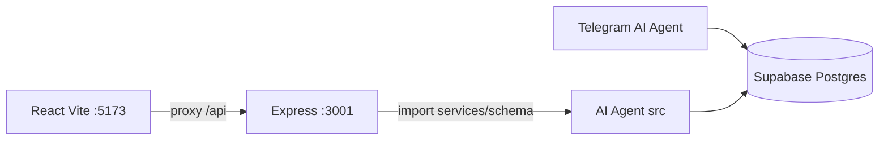

# Personal Dashboard — Project Overview

Narrative summary of what this project is, how it fits with the AI Agent, and what each area of the app does. For setup steps and the full API table, see [README.md](../README.md).

## Purpose

Personal finance and health dashboard oriented around **Asia/Kuala_Lumpur** (MYR / Malaysia). It is a browser UI over the same Supabase Postgres database used by the sibling **[AI Agent](../../AI%20Agent)** Telegram bot:

- The bot logs expenses, income, workouts, and meals from chat.
- This Dashboard visualizes monthly budgets, accounts, and health stats, and supports the same kinds of CRUD from the UI.

Data is scoped to one Telegram user via `TELEGRAM_USER_ID`.

## Architecture



- The Express server does **not** call the bot over HTTP.
- It **imports** Drizzle schema and domain services from `../AI Agent/src/...` (expenses, incomes, payment accounts, gym, nutrition, settings, etc.).
- Vite proxies `/api` from port **5173** to the API on **3001**.
- Startup loads expense categories and payment-account config from the AI Agent side so both apps stay aligned.

## Tabs and features

Global **month picker** drives Expenses, Income, and Setup. Health uses date ranges / calendars as needed.

### Expenses

- Summary cards (salary, amount can use, fixed total, budget, actual spend).
- Variable category budgets with status (ok / near / over).
- Spending calendar and day panel: expense + income CRUD for that day.
- Shared-bill **reimbursements** on create (linked `Transfer` income; reduces net spend).
- **Investment** and **Other** expenses support **From → To** accounts and create a linked `Account transfer` income so balances move without double-debiting.

### Income

- Income calendar, daily series, and transaction CRUD.
- Categories include Claim, Transfer, Salary, Account transfer, Cashback, Other.
- Per-account **balances** (debit / credit available / investment); click an account for activity, cashback, and settle.

### Health

- Activity calendar with day detail; workouts grouped by **session**.
- Workout analytics: volume, top exercises, weight trend, personal records.
- Nutrition: daily macros vs targets (`bodyWeightKg` and targets from `user_settings`).
- Optional workout fields from the bot: `caloriesBurned`, `fatBurnG`.

### Setup

- Fixed / recurring expenses with **category** and **payment method** filters.
- **Payment accounts** management: add / edit / delete `account` (debit), `credit`, `investment` (limits, statement day, rebate rules).
- Meal goals: daily calorie / protein / carbs / fat targets and body weight (`user_settings`).

## Tech stack

| Layer | Stack |
|-------|--------|
| Client | React 19, Vite 6, TypeScript, Recharts |
| Server | Express 5, `tsx`, CORS, dotenv |
| Database | Supabase Postgres (`DATABASE_URL`) |
| Shared logic | Drizzle ORM + services from sibling AI Agent |

## How to run

```bash
npm install
cp .env.example .env
# Set DATABASE_URL and TELEGRAM_USER_ID (from AI Agent .env)
npm run dev
```

- UI: [http://localhost:5173](http://localhost:5173)
- API: [http://localhost:3001](http://localhost:3001)

Separate processes: `npm run dev:server` / `npm run dev:client`.

### Environment

| Variable | Role |
|----------|------|
| `DATABASE_URL` | Supabase Postgres URL (same as AI Agent) |
| `TELEGRAM_USER_ID` | Bot user id (`ctx.from.id`) |
| `DATABASE_POOLER_REGION` | Optional pooler fallback |
| `PORT` | API port (default `3001`) |

The sibling **AI Agent** repo must sit next to this project so server imports resolve. Older databases may need Agent migration scripts (e.g. workout sessions).

## Repo map

```
Dashboard/
  README.md                 # Setup + API reference
  docs/PROJECT_OVERVIEW.md  # This file
  package.json
  .env.example
  client/                   # Vite React app
    src/
      App.tsx / api.ts / App.css
      components/           # Tabs, calendars, tables, payment/credit UI, health
      charts/               # Recharts visuals
      hooks/                # Month, accounts, pagination, smart refresh
      utils/                # Dates, categories, rebate form, statement periods
  server/                   # Express API
    index.ts
    accountBalances.ts      # Debit balance + credit amountOwed
    aggregators.ts / rebate.ts / statementPeriod.ts
    routes/
      expenses.ts | incomes.ts | paymentAccounts.ts
      workouts.ts | nutrition.ts | sync.ts
```

API routes are listed in [README.md](../README.md). Beyond that table, the server also exposes payment-account and sync-status endpoints used by the Income tab and live refresh.

## Related system: AI Agent

| Role | Project |
|------|---------|
| Capture (Telegram) | AI Agent bot |
| Visualize + manage (browser) | This Dashboard |
| Source of truth | Shared Supabase DB |

Keep `DATABASE_URL` and `TELEGRAM_USER_ID` in sync between both `.env` files so bot logs and dashboard views refer to the same user data.
